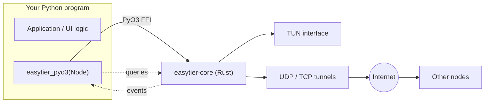

# EasyTier-PyO3 Tutorial

[EasyTier-PyO3](https://github.com/ECLTeam/EasyTier-PyO3) is a **Python binding library** for [EasyTier](https://github.com/EasyTier/EasyTier) (an open-source decentralized mesh P2P VPN), written with [PyO3](https://pyo3.rs).

It lets you `import easytier_pyo3` and create, start and manage an EasyTier node directly from Python — **without** downloading the `easytier-core` binary, assembling a command line, or parsing stdout. Reading peer and route snapshots, subscribing to node events, changing port forwarding at runtime and managing access credentials are all ordinary method calls.

::: tip Prerequisites
This tutorial assumes you can already write Python. Before you start, make sure that you:

1. Know the Python basics: virtual environments, `pip`, `dict`/`list`, `try`/`except`, threads
2. Use a **64-bit interpreter of Python 3.11 or newer** (no builds are published for 3.9 / 3.10)
3. Understand basic networking: IP addresses, CIDR subnets (such as `10.144.144.1/24`), ports, TCP / UDP
4. Ideally know what a virtual network interface (TUN) is — but this is **not required**, since the tutorial starts with a TUN-free setup
:::

> 📝 **Note**: this tutorial focuses on ideas plus runnable snippets. The goal is that you can build a working mesh program yourself, not paste a finished product.

---

## What problem does it solve

EasyTier joins several machines scattered around the internet into one **virtual LAN**: each machine gets a virtual IP (for example `10.144.144.1`) and can then reach the others as if they sat behind the same switch. Traffic is end-to-end encrypted, connections are P2P whenever hole punching succeeds, and relayed when it does not.

Upstream ships a CLI (`easytier-core` / `easytier-cli`). If your program is written in Python, driving that CLI means:

| With the CLI | With EasyTier-PyO3 |
|--------------|--------------------|
| Generate config files / assemble command-line arguments | Pass a `dict` or a TOML string |
| `subprocess` plus parsing `stdout` / `stderr` | Call methods and get Python `dict` / `list` back |
| Infer state from exit codes and log strings | `state()` / `is_ready()` / `latest_error()` |
| Parse the `easytier-cli peer` table to see peers | `peers()` / `routes()` return structured data |
| Restart the process or speak RPC to change runtime config | `apply_config()` / `add_connector()` take effect immediately |

For launchers, co-op tools and tunnel dashboards — anything that needs to bind network state directly into its own program state and UI — the second column is simply easier.



---

## Requirements and installation

### Install directly

```bash
pip install easytier-pyo3
```

### Verify

```bash
python -c "from easytier_pyo3 import version; print(version())"
# prints something like: 2.6.4 (the EasyTier core version)
```

### Supported platforms

| OS | Architecture | Python | Notes |
|----|--------------|--------|-------|
| Linux | x86_64 | 3.11 / 3.12 / 3.13 | manylinux 2_28 (glibc 2.28+) |
| Windows | x86_64 | 3.11 / 3.12 / 3.13 | Full feature set (including fake-tcp) |
| Windows | ARM64 | 3.11 / 3.12 / 3.13 | Experimental; no WinDivert on aarch64, basic tunnels only |
| macOS | arm64 | 3.11 / 3.12 / 3.13 | `macos-latest` |

> 💡 **Building from source** (to patch the code or compile a private build) needs Rust 1.85+, `maturin` and a C/C++ toolchain. The first build downloads hundreds of EasyTier dependencies and may take **10–40 minutes**. The full procedure lives in `docs/BUILDING.md` in the repository and is not repeated here.

### A word about privileges

- **Linux**: creating a TUN device requires `CAP_NET_ADMIN` (usually `sudo`), or granting that capability to the binary.
- **macOS**: creating a TUN device requires root.
- **Windows**: creating a TUN device requires running **as Administrator**.

Workloads that do not need a TUN device (connectivity tests, port forwarding, peer discovery checks) can run with `flags.no_tun = True` under normal privileges — the examples below take that route.

---

## Five minutes to a working setup

Before anything else, confirm that the library actually runs. The snippet below starts two nodes on one machine: node A listens on `127.0.0.1:11010`, node B connects to it, and the two should discover each other.

```python
import time

from easytier_pyo3 import Node, version

print("core version:", version())

NET = {"network_name": "demo", "network_secret": "demo-secret"}
# no_tun=True       : do not create a TUN device (no admin rights needed)
# bind_device=False : required with no_tun, otherwise connections fail with WSAEADDRNOTAVAIL(10049)
FLAGS = {"no_tun": True, "bind_device": False}

node_a = Node({
    "instance_name": "a",
    "network_identity": NET,
    "flags": FLAGS,
    "listeners": ["tcp://127.0.0.1:11010"],
})
node_a.start()
print("A:", node_a.state(), "peer_id =", node_a.peer_id())

node_b = Node({
    "instance_name": "b",
    "network_identity": NET,
    "flags": FLAGS,
    "peer": [{"uri": "tcp://127.0.0.1:11010"}],
})
node_b.start()

deadline = time.time() + 10
while time.time() < deadline and not node_b.peers():
    time.sleep(0.5)

print("peers seen by A:", node_a.peers())
print("peers seen by B:", node_b.peers())
print("route table of B:\n", node_b.dump_route())

node_a.stop()
node_b.stop()
```

If `peers()` is non-empty on both sides, the EasyTier core, the Python bindings, events and queries all work.

::: warning Three classic traps
1. **Without `listeners`, a node listens on nothing.** This library does not go through the CLI, so the CLI convention of defaulting to port `11010` **does not apply** here. If B cannot connect, this is the first thing to check.
2. **`no_tun = True` must be paired with `bind_device = False`.** Otherwise client sockets try to bind to a virtual IP that is not active yet, and Windows reports `WSAEADDRNOTAVAIL(10049)`.
3. **Both sides need identical `network_name` / `network_secret`.** Otherwise they are treated as two different networks and will never see each other.
:::

---

## Concept map

Keep this table in mind while reading the remaining chapters:

| Concept | In Python | Notes |
|---------|-----------|-------|
| Node | a `Node(config)` object | One node = one dedicated tokio runtime plus one event bus |
| Config | `dict` or TOML string | Field names match the `easytier-core` config file |
| Network identity | `network_identity` | `network_name` + `network_secret`; the only test for "same network" |
| Virtual address | `ipv4` / `ipv6` | The node's address in that virtual network, e.g. `10.144.144.1/24` |
| Listeners / peers | `listeners` / `peer` | How others find me / how I find others |
| Runtime switches | `flags` | Dozens of behaviour flags (`no_tun`, `mtu`, encryption, hole punching…) with explicit defaults |
| Events | `events()` / `next_event()` | Peer joins, connections, TUN readiness — shaped as `{"event_name": payload}` |
| Snapshots | `peers()` / `routes()` / `metrics()` | Pull current state as structured `dict` / `list` |
| Runtime reconfiguration | `apply_config()` / `add_connector()` | Change port forwarding, routes, exit nodes while Running |

---

## Contents

1. [Node configuration in depth](/en/tutorials/easytier-pyo3/fundamentals/configuration/) — what `Node()` accepts, what each field means, what `apply_config()` can change
2. [Node lifecycle and runtime management](/en/tutorials/easytier-pyo3/fundamentals/node-runtime/) — state machine, connection management, snapshots, events, threading model
3. [Advanced networking and deployment](/en/tutorials/easytier-pyo3/advanced/deployment/) — port forwarding, routes and exit nodes, credentials and ACLs, platform notes and troubleshooting

---

## Links

- Source code and full API reference: [ECLTeam/EasyTier-PyO3](https://github.com/ECLTeam/EasyTier-PyO3)
- Upstream EasyTier: [EasyTier/EasyTier](https://github.com/EasyTier/EasyTier)
- Upstream documentation: [easytier.cn](https://easytier.cn)
- License: **LGPL-3.0** (same as EasyTier)
