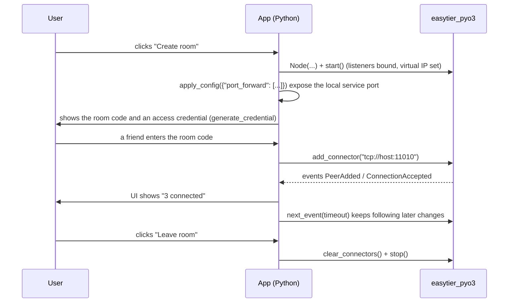

# Advanced Networking and Deployment

The first two chapters covered *starting up* and *staying in control*. This one covers *using it well*: mapping a peer's service port to your machine, letting others route their internet traffic through you, issuing access rights safely, and the details that bite during cross-platform deployment.

---

## 1. Port forwarding: bringing a virtual IP port to localhost

**The problem**: a peer runs a service inside the virtual network (`10.144.144.2:80`), but your program only ever connects to `127.0.0.1:xxxx` and you would rather not touch virtual IPs in code.

**The fix**: add a forwarding rule so local `127.0.0.1:8080` leads straight to port `80` on the peer.

### Configure at startup

```python
node = Node({
    "network_identity": {"network_name": "net1", "network_secret": "secret"},
    "ipv4": "10.144.144.1/24",
    "port_forward": [
        {"bind_addr": "127.0.0.1:8080", "dst_addr": "10.144.144.2:80", "proto": "tcp"},
    ],
})
```

A rule has exactly three fields:

| Field | Meaning |
|-------|---------|
| `bind_addr` | Local listen address: `127.0.0.1:8080` (this machine only) or `0.0.0.0:8080` (reachable on the LAN) |
| `dst_addr` | Target address inside the **virtual network**, e.g. `10.144.144.2:80` |
| `proto` | `tcp` or `udp` only |

> ⚠️ Any other `proto` value raises `ValueError` (matching the CLI's validation). It is the one field that stops you at configuration time, so typos surface immediately.

### Add and remove at runtime

Port forwarding is one of the few fields `apply_config()` can change, so "user clicks a button and a local port opens" can take effect live:

```python
# Add: local 8080 -> peer port 80
node.apply_config({
    "port_forward": [
        {"bind_addr": "127.0.0.1:8080", "dst_addr": "10.144.144.2:80", "proto": "tcp"},
    ],
})

# Then add one more: local 25565 -> peer 25565 (a game server)
node.apply_config({
    "port_forward": [
        {"bind_addr": "127.0.0.1:8080",  "dst_addr": "10.144.144.2:80",    "proto": "tcp"},
        {"bind_addr": "127.0.0.1:25565", "dst_addr": "10.144.144.2:25565", "proto": "tcp"},
    ],
})

# Clear everything (the user switched sharing off)
node.apply_config({"port_forward": []})
```

::: warning Collection fields are replaced wholesale
`port_forward` is **not append-only**. Sending a second call with a single new rule drops the first one.
Keep your own complete list of rules:

```python
rules = [
    {"bind_addr": "127.0.0.1:8080", "dst_addr": "10.144.144.2:80", "proto": "tcp"},
]
node.apply_config({"port_forward": rules})

# Later: mutate your list first, then send the whole thing
rules.append({"bind_addr": "0.0.0.0:9090", "dst_addr": "10.144.144.3:3306", "proto": "tcp"})
node.apply_config({"port_forward": rules})
```
:::

### Port forwarding is not a "tunnel dashboard"

It only forwards **inside the virtual network**: `dst_addr` must be a virtual IP of the same network. Exposing real services behind a peer is the job of `proxy_network`, covered next.

---

## 2. Routes, proxied subnets and exit nodes

So far everything was about nodes reaching each other. This section extends the virtual network to the **real networks behind each node**.

| Concept | Field / method | What it solves |
|---------|----------------|----------------|
| Advertised routes | `routes` | Tell everyone in the network that a real subnet is reachable through me |
| Proxied subnets | `proxy_network` | Bring a real subnet (such as your home `192.168.1.0/24`) into the virtual network |
| Exit nodes | `exit_nodes` / `flags.enable_exit_node` | Let other nodes browse the internet through your machine |

### `routes`: announce what is behind me

```python
"routes": ["192.168.1.0/24", "10.10.0.0/16"]
```

Once configured, other nodes wanting to reach `192.168.1.x` hand that traffic to this node to forward. Ideal for "one office machine acts as gateway and pulls the whole office LAN into the virtual network".

### `proxy_network`: proxy a subnet into the virtual network

```python
"proxy_network": [
    {"cidr": "192.168.1.0/24"},
    {"cidr": "10.10.0.0/16", "allow": ["10.144.144.0/24"]},   # only some nodes may use it
]
```

- `cidr` is the real subnet being proxied in;
- `allow` is optional: a whitelist of **virtual** subnets permitted to reach that subnet. Omit it to allow everyone.

Roughly: `proxy_network` says "this network exists behind me (and here is who may use it)", while `routes` announces the routes for it. In practice the two are usually configured together.

> 📝 Both fields can be overwritten at runtime with `apply_config()` (also wholesale), which makes on-demand toggling of a shared subnet easy.

### Exit nodes: borrowing someone else's internet

**On the node offering connectivity** (say, the one with generous bandwidth):

```python
node = Node({
    "network_identity": {...},
    "ipv4": "10.144.144.1/24",
    "flags": {"enable_exit_node": True},   # declare willingness to act as an exit
})
```

**On the node that wants to use it**:

```python
"exit_nodes": ["10.144.144.1"]
```

Either of these changes it at runtime:

```python
node.update_exit_nodes(["10.144.144.1"])             # lightweight: exit nodes only
node.apply_config({"exit_nodes": ["10.144.144.1"]})  # generic: through apply_config
```

> ⚠️ An exit node means **your traffic may leave via someone else's machine**, and conversely your machine carries theirs. That is a trust boundary, not a technicality — only use it between machines you control.

---

## 3. Access credentials and access control

### Why you should not hand out `network_secret`

`network_secret` is the sole test for "same network". Once it is shared, the recipient **permanently** holds full access to that network, and revoking means rotating the secret and reconfiguring everyone.

### The solution: access credentials

**Requirement**: only an **admin node** (a node configured with `network_secret`) can issue credentials; otherwise the call raises `RuntimeError`.

```python
cred = node.generate_credential(
    groups=["guest"],              # required: group this credential belongs to
    allowed_proxy_cidrs=[],        # required: subnets it may proxy
    allow_relay=False,
    ttl_seconds=86400,             # valid for one day
    reusable=True,                 # may be used more than once
)

print(cred["credential_id"])
print(cred["secret"])              # give this secret to the peer as its network_secret
print(cred["expiry_unix"])         # expiry timestamp
```

The returned `secret` is the access key you distribute — the peer puts it into `network_identity.network_secret` and joins, with **automatic expiry** once the TTL passes.

Managing credentials:

| Method | Notes |
|--------|-------|
| `credentials()` | List all credentials (with `credential_id`, `groups`, `expiry_unix`, `reusable`, `public_key_fingerprint`, …) |
| `revoke_credential(credential_id)` | Revoke; `True` on success, `False` if it does not exist |
| `upsert_credential(...)` | Import or update an existing credential; `True` when something changed |

```python
# Kick out a temporary guest
node.revoke_credential("abc")

# Inspect who is currently authorised
for c in node.credentials():
    print(c["credential_id"], c["groups"], c["expiry_unix"], c["reusable"])
```

`upsert_credential()` has **no default arguments**, so spell every field out when importing:

```python
node.upsert_credential(
    credential_id="abc",
    credential_secret="def",
    groups=["guest"],
    allow_relay=False,
    allowed_proxy_cidrs=[],
    expiry_unix=1700000000,
    reusable=True,
)
```

Credential changes fire a `CredentialChanged` event, which is handy for refreshing a "currently connected users" list.

### ACLs: limiting what happens after joining

Credentials answer "may I join"; ACLs answer "what may I reach once inside".

```python
node = Node({
    "network_identity": {...},
    "acl": {...},                          # ACL rules
    "tcp_whitelist": ["80", "443"],        # port whitelists
    "udp_whitelist": ["53"],
})
```

- With no `acl` configured, **all traffic is allowed** (the default, and the reason tests need not care);
- `tcp_whitelist` / `udp_whitelist` whitelist specific ports;
- `apply_config()` can replace ACLs and whitelists at runtime; call `refresh_acl_groups()` afterwards when groups are involved;
- `acl_stats()` gives statistics, `acl_whitelist()` the effective whitelist:

```python
print(node.acl_whitelist())   # {'tcp_ports': ['80', '443'], 'udp_ports': ['53']}
```

> 💡 ACLs combine with credential `groups` to express policies like "regular players may only reach game ports, admins everything". **Any room opened to strangers should configure ACLs**, otherwise they can scan your entire subnet once inside.

---

## 4. Cross-platform notes

### Windows

| Item | Notes |
|------|-------|
| Creating a TUN device | **Requires Administrator privileges**, otherwise startup fails |
| Bundled DLLs | The wheel ships `wintun.dll`, `Packet.dll` and `WinDivert64.sys`; importing the module adds the pyd directory to the process DLL search path, so **nothing needs to be placed by hand** |
| Interfaces | EasyTier creates its own dedicated wintun interface (`et_*`) and only adds on-link routes for the virtual subnet — **no default route** — leaving other VPNs (such as Radmin VPN) untouched |
| After stopping | Interface and routes are cleaned up automatically |
| Same-machine loopback tests | Need `bind_device = false`, otherwise connections fail with `WSAEADDRNOTAVAIL(10049)` |
| ARM64 | Experimental; EasyTier **does not support WinDivert on aarch64**, so basic TCP/UDP tunnels only |

### Linux

| Item | Notes |
|------|-------|
| Creating a TUN device | Requires `CAP_NET_ADMIN` (usually `sudo`), or granting that capability to the binary |
| `netns` | Place the node inside a given network namespace (startup-only, immutable at runtime) |
| `socket_mark` | Set `flags.socket_mark` to mark sockets with SO_MARK for routing policies |
| Building | Needs a system `protoc` (`sudo apt install protobuf-compiler`) |

### macOS

Creating a TUN device requires root. Building needs Xcode Command Line Tools and `brew install protobuf`.

> 📝 If your program does not run elevated all the time, common approaches are: **elevate only when a TUN device is needed**, or offer a "no-TUN mode" (`no_tun = true`) as a fallback — it still supports port forwarding and events, just no direct pings to virtual IPs.

---

## 5. Fitting into a launcher or co-op tool

Putting it all together, a "click once and play together" flow looks like this:



A few practical rules:

1. **Never guess state.** Rely on `state()` / `is_ready()` / `peers()` / `routes()` — the core is more reliable than your inference.
2. **Keep blocking calls off the UI thread.** `start()` and the snapshot queries block (they release the GIL, but the calling thread still waits). The UI thread should only read caches and render.
3. **Report failures readably.** Show `latest_error()` together with "are you running as Administrator / is the port already taken" — far more useful than "connection failed".
4. **Always clean up on exit.** Put `stop()` in `finally` so the TUN interface, routes and listening ports are released.
5. **Never ship `network_secret` to the front end.** Issue credentials from an admin node with `generate_credential()`, keep TTLs short, and use `revoke_credential()` when needed.

---

## 6. Troubleshooting checklist

| Symptom | Most likely cause | How to confirm / fix |
|---------|-------------------|----------------------|
| `state()` is `Running` but peers never discover you | Mismatched `network_identity`, or no `listeners` | Compare `network_name` / `network_secret` on both sides; check whether `running_listeners()` is empty |
| `WSAEADDRNOTAVAIL(10049)` | `no_tun = true` without `bind_device = false` | Set both flags together |
| `RuntimeError` on start / TUN creation failure | Insufficient privileges | Run as Administrator on Windows, add `CAP_NET_ADMIN` on Linux, or switch to no-TUN mode |
| Cannot reach a peer port although pinging the virtual IP works | Missing `port_forward` rules | `apply_config({"port_forward": [...]})` is **wholesale**; check the complete rule list |
| Port forwarding raises `ValueError` | `proto` is not `tcp` / `udp` | Use lowercase `tcp` or `udp` |
| Statistics come out as garbage strings | Integers in `stats` are strings | Call `int()` before arithmetic |
| Credential calls raise `RuntimeError` | The node is not an admin node | Its config must include `network_secret` |
| No events arrive | They fired before you subscribed, or `events()` drained the buffer | Reconcile with `peers()` first; do not mix the semantics of `events()` and `next_event()` |
| `apply_config()` errors | Node is not `Running`, or a startup-only field was changed | `start()` first; startup fields (`listeners` / `flags`, …) require a new node |
| A dynamically added peer has no effect | `peer` was modified through `apply_config` | `peer` is not managed there; use `add_connector()` |
| Metrics exporters show nothing | Nothing was exported | Use `prometheus_metrics()` or `metrics()` |

---

## 7. Summary

- **Port forwarding** maps virtual IP ports onto localhost through `bind_addr` / `dst_addr` / `proto`, and can be replaced wholesale at runtime via `apply_config()`.
- **`routes` / `proxy_network` / `exit_nodes`** bring the real networks behind nodes into the mesh; exit nodes are a trust decision, not a technical one.
- **Access credentials** replace handing out `network_secret`: TTLs and revocation, issued by an admin node; **ACLs** bound what a member may reach once inside.
- The only fundamental cross-platform difference is that **creating a TUN device requires privileges**. No-TUN mode is a solid fallback.
- Almost every "cannot connect" traces back to `network_identity`, `listeners` or `bind_device` — check them in that order.

That covers EasyTier-PyO3 end to end: configuration, lifecycle, queries and events, port forwarding, access control and deployment. From here, read the repository's complete [`Node` API reference](https://github.com/ECLTeam/EasyTier-PyO3/blob/master/docs/python_api.md) and fill in whatever else you need.
