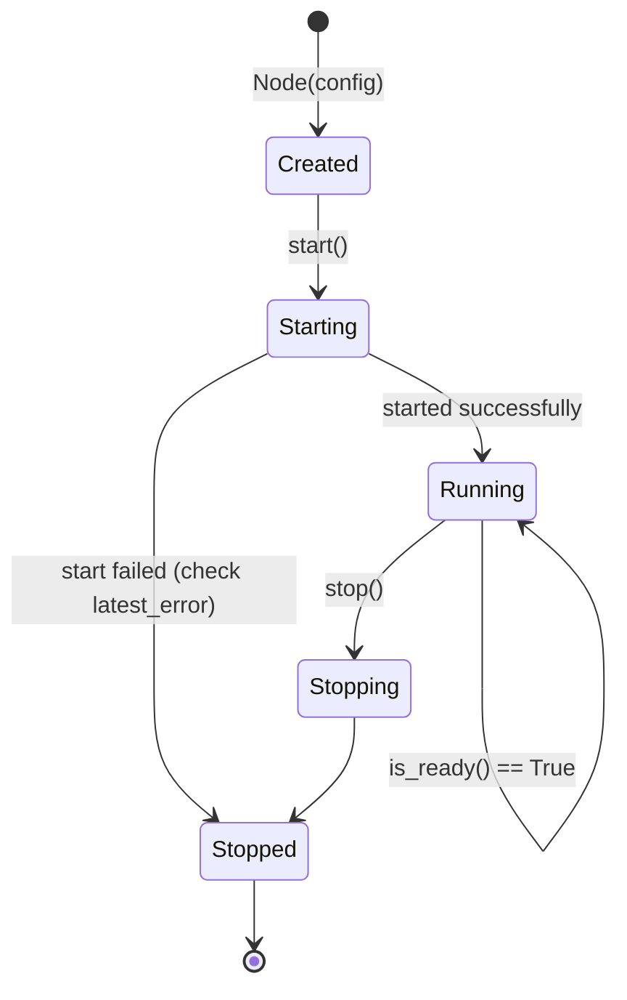

# Node Lifecycle and Runtime Management

Configuration is about *how to start*. This chapter is about *how to manage once it is running*: which states exist, how to start and stop cleanly, how to add and remove peers at runtime, how to read peers/routes/metrics, and how to push changes into your program with events.

::: tip One premise to remember
**Every method on `Node` may be called concurrently from multiple Python threads.** Mutable state is protected by internal locks, so you will not hit Rust's `Already mutably borrowed`.
In addition, "slow" operations such as `start()` / `stop()` and the snapshot queries **release the GIL**, so a background thread blocking on events never stalls the main thread — exactly what the "background thread listens for events, main thread paints the UI" pattern requires.
:::

---

## 1. Lifecycle and state machine

A node moves through these states (the strings returned by `state()`):



| Method | Purpose | Notes |
|--------|---------|-------|
| `start()` | Start the node, **blocking** until startup completes | Raises `RuntimeError` on failure |
| `stop()` | Stop the node | **Idempotent**; safe to call repeatedly, and without a prior start |
| `wait()` | Block until the node stops | Useful when the main thread is effectively the foreground process |
| `state()` | Current state string | `Created` / `Starting` / `Running` / `Stopping` / `Stopped` |
| `is_ready()` | Whether startup succeeded | Equivalent to `state() == "Running"` |
| `latest_error()` | Most recent startup/runtime error | `None` when there is none |

### Diagnosing a failed start

`start()` raises `RuntimeError` on failure, but the exception message may not carry every detail (TUN creation failures, for example, are often reported asynchronously). Do both:

```python
from easytier_pyo3 import Node

node = Node({
    "network_identity": {"network_name": "net1", "network_secret": "secret"},
    "ipv4": "10.144.144.1/24",
    "listeners": ["tcp://0.0.0.0:11010"],
})

try:
    node.start()
except RuntimeError as exc:
    print("start failed:", exc)
    # Ask the core again; this is usually more specific
    print("latest_error():", node.latest_error())
    raise

print("state:", node.state(), "| is_ready:", node.is_ready())
```

> ⚠️ The most common startup failure is **privileges**: not running as Administrator on Windows, or lacking `CAP_NET_ADMIN` on Linux. If you only need connectivity, add `"flags": {"no_tun": True, "bind_device": False}` and continue.

### `wait()` and graceful shutdown

When the program *is* the node, `wait()` parks the main thread naturally:

```python
import signal

node = Node({...})
node.start()
print("running, press Ctrl+C to exit")
signal.signal(signal.SIGINT, lambda *_: node.stop())  # stop the node on interrupt
node.wait()                                           # block until the node stops
print("exited, final state:", node.state())
```

::: warning Always call `stop()` explicitly
When a `Node` object is garbage collected, its runtime is shut down in the background only — **cleanup of TUN devices and similar system resources is not guaranteed**.
Put `stop()` in your `finally` block or shutdown hook. Once a node stops, its virtual interface and related routes are cleaned up automatically.
:::

---

## 2. Basic information

| Method | Returns | Notes |
|--------|---------|-------|
| `instance_id()` | str | Unique node ID (UUID); a random UUID v4 unless you set `instance_id` |
| `instance_name()` | str | Node name (`instance_name`, default `"default"`) |
| `peer_id()` | int | This node's peer id inside the virtual network (assigned by the network) |
| `running_listeners()` | list[str] | Addresses **actually** being listened on — confirms the ports really came up |
| `management_events()` | list[str] | Recent management events as strings |

```python
print(node.instance_name(), node.instance_id())
print("peer_id =", node.peer_id())
print("actually listening:", node.running_listeners())
```

`running_listeners()` is not the same as the configured `listeners`: the config states intent, the former reports what the core really bound. Failures such as a port already in use show up here.

`peer_id()` may not be assigned yet immediately after start, before the handshake with the network completes — use `instance_id()` when you need a stable identifier.

---

## 3. Manual connection management

`peer` can only be given at startup. To add or remove peers at runtime, use these three methods:

| Method | Returns | Notes |
|--------|---------|-------|
| `add_connector(url)` | None | Add a peer connection address |
| `remove_connector(url)` | bool | Remove the address; `True` on success |
| `clear_connectors()` | None | Drop every manual connection |
| `connectors()` | list[dict] | Current manual connections, each shaped `{"url": ..., "status": ...}` |

```python
node.add_connector("tcp://10.0.0.5:11010")

for conn in node.connectors():
    print(conn["url"], conn["status"])   # status reflects whether this link is up

node.remove_connector("tcp://10.0.0.5:11010")
```

The classic use case is **room-based co-op**: switching rooms in the UI does not require rebuilding the node, only swapping the connector:

```python
def join_room(node, host_ip: str, port: int = 11010) -> None:
    node.clear_connectors()                # leave the previous room first
    node.add_connector(f"tcp://{host_ip}:{port}")
```

> 💡 One reminder: the `uri` scheme (`tcp://` / `udp://`) must match the peer's `listeners`, and `network_identity` must be identical on both sides.

---

## 4. Snapshots: reading node state out

The methods below **block internally** waiting for EasyTier to answer, and return plain Python `dict` / `list` values.

| Method | Returns | Use it for |
|--------|---------|-----------|
| `peers()` | list[dict] | Every peer **connection** snapshot (who you are connected to, over which link) |
| `routes()` | list[dict] | Current **route** snapshot (who is in the network, addresses, cost, NAT type) |
| `node_info()` | dict | This node's own info (addresses, listeners, version, STUN, …) |
| `dump_route()` | str | The route table as text — **the first thing to look at when debugging** |
| `global_peer_map()` | dict | Global peer map snapshot |
| `local_public_ipv6()` | dict | This node's public IPv6 information |
| `foreign_networks(include_trusted_keys)` | dict | Foreign network snapshots keyed by network name |
| `foreign_network_route_infos()` | dict | Foreign network route information |
| `foreign_network_route_summary()` | dict | Foreign network route summary |

```python
print("peers:", node.peers())
print("route table:\n", node.dump_route())

info = node.node_info()
print(info["peer_id"], info["ipv4_addr"], info["version"])
```

### `peers()` versus `routes()`

This is the most commonly confused pair, and it matters when debugging:

- **`peers()` answers "who am I connected to".** It is the **connection view** — the tunnels between this machine and its peers.
- **`routes()` answers "who is in this virtual network and how do I reach them".** It is the **topology view**, including nodes you are not directly connected to but reach through someone else.

So when "three people should be listed but only two show up", reach for `routes()` to inspect the topology instead of staring at `peers()`.

A single `peers()` entry looks roughly like this:

```python
{
    "peer_id": 12346,
    "default_conn_id": "uuid-string",      # primary connection id, may be None
    "directly_connected_conns": ["uuid-string"],
    "conns": [ ... ],                      # per-connection detail (stats / tunnel / loss_rate)
}
```

> ⚠️ **An easy trap to fall into**: `latency_us`, `rx_bytes` and `tx_bytes` inside `conns[].stats` are int64/uint64 values serialised through pbjson, so **they arrive in Python as strings**. Call `int()` before doing arithmetic, otherwise you get string concatenation or a `TypeError`.
> ```python
> total_rx = sum(int(c["stats"]["rx_bytes"]) for p in node.peers() for c in p["conns"])
> ```
>
> A related difference: `node_info()["ipv4_addr"]` is already a CIDR string (such as `"10.144.144.1/24"`), while `ipv4_addr` inside `routes()` is the proto `Ipv4Inet` struct (`address.addr` being a 32-bit integer) which you convert with the standard `ipaddress` module.

### Recreating the `easytier-cli peer` table

The CLI table is **not** the direct output of a single method — it is `peers()` and `routes()` merged by `peer_id`. The mapping:

| CLI column | Source |
|------------|--------|
| `ipv4` / `hostname` / `cost` / `version` | The matching `routes()` entry |
| `lat(ms)` | The `default_conn_id` connection in `peers()`: `stats.latency_us / 1000` |
| `loss` | `loss_rate` of that same connection |
| `rx` / `tx` | Sum of `rx_bytes` / `tx_bytes` across all `conns[].stats` in `peers()` |
| `tunnel` | Deduplicated `tunnel.tunnel_type` across `peers()` connections |
| `NAT` | `stun_info.udp_nat_type` of the matching `routes()` entry |
| The local row | `node_info()` |

---

## 5. Metrics and ACL statistics

| Method | Returns | Notes |
|--------|---------|-------|
| `metrics()` | list[dict] | All metric snapshots, each `{"name": ..., "labels": {...}, "value": ...}` |
| `prometheus_metrics()` | str | Prometheus text format, ready to be scraped |
| `acl_stats()` | dict | ACL statistics |
| `acl_whitelist()` | dict | Current ACL whitelist, e.g. `{"tcp_ports": ["80"], "udp_ports": ["53"]}` |

To feed a monitoring system, `prometheus_metrics()` is the easy path:

```python
Path("easytier.prom").write_text(node.prometheus_metrics(), encoding="utf-8")
```

To draw your own charts (a latency/traffic panel in a co-op tool), filter `metrics()` yourself:

```python
for m in node.metrics():
    if "traffic" in m["name"]:
        print(m["name"], m["labels"], m["value"])
```

---

## 6. Events: letting the node notify you

Polling `peers()` gives you state but **never the transitions**. Use events to react to "someone joined / dropped / a tunnel broke" in real time.

| Method | Returns | Semantics |
|--------|---------|-----------|
| `events()` | list[dict] | **Non-blocking**: drain every pending event and clear the buffer |
| `next_event(timeout)` | dict \| None | **Blocking**: wait for the next event; returns `None` on timeout |

Every event is a `{"event_name": payload}` dict:

```python
import threading

def printer() -> None:
    while True:
        event = node.next_event(timeout=2.0)   # releases the GIL, does not stall the main thread
        if event is not None:
            print("event:", event)

threading.Thread(target=printer, daemon=True).start()
```

### Event reference

| Event | Payload | Meaning |
|-------|---------|---------|
| `TunDeviceReady` | str | TUN device ready (payload is the device name) |
| `TunDeviceError` | str | TUN device error |
| `PeerAdded` / `PeerRemoved` | int (peer_id) | Peer joined / left |
| `PeerConnAdded` / `PeerConnRemoved` | dict | Connection to a peer established / dropped |
| `ConnectionAccepted` | [local, remote] | Tunnel established |
| `ConnectionError` | [local, remote, msg] | Tunnel error |
| `ListenerAdded` | str | Listener started successfully |
| `ListenerAddFailed` | [url, msg] | Listener failed to start |
| `CredentialChanged` | None | Credentials changed |
| `VpnPortalStarted` | str | VPN Portal started |

Printed output looks roughly like:

```python
{"TunDeviceReady": "easytier0"}
{"PeerAdded": 123}
{"PeerConnAdded": {...}}
{"ConnectionAccepted": ["tcp://0.0.0.0:11010", "tcp://1.2.3.4:4567"]}
```

::: tip `events()` or `next_event()`?
- **For UI or logging**: `next_event()` on a background thread, handling each event as it arrives — the lowest latency.
- **For batched refreshes** (repainting once a second): drain with `events()` and handle everything at once, avoiding redundant redraws.
- The two **share one buffer**: `events()` clears it, so do not poll and block on the same buffer at the same time.
:::

### Events are best-effort

Events drive interaction; they are not a reliable log. Events produced right after startup may be emitted before you begin listening. The correct pattern is therefore — **reconcile current state with a snapshot first, then follow changes with events**:

```python
# 1. Align with the current state
known_peers = {p["peer_id"] for p in node.peers()}

# 2. Then follow changes with events
while True:
    event = node.next_event(timeout=2.0)
    if not event:
        continue
    if "PeerAdded" in event:
        known_peers.add(event["PeerAdded"])
    elif "PeerRemoved" in event:
        known_peers.discard(event["PeerRemoved"])
```

---

## 7. Other runtime operations

| Method | Notes |
|--------|-------|
| `update_exit_nodes(ips)` | Update the exit node list at runtime (lighter than a full `apply_config`) |
| `close_peer_conn(peer_id, conn_id)` | Close one connection to a peer — drop a suspicious link or force a reconnect |
| `refresh_acl_groups()` | Refresh ACL groups |
| `attach_tun_fd(fd)` | Hand an **existing** TUN file descriptor to the node (only when you manage the TUN lifecycle yourself) |

The full `apply_config()` behaviour is covered in the [previous chapter](/en/tutorials/easytier-pyo3/fundamentals/configuration/), final section.

---

## 8. Putting it together: a small node manager

Wrapping the pieces in a reusable class gives you the seed of the "network module" inside a launcher or co-op tool:

```python
import threading
from easytier_pyo3 import Node

NET = {"network_name": "my-room", "network_secret": "a-long-random-secret"}
FLAGS = {"no_tun": True, "bind_device": False}   # drop these two to enable TUN in production


class NetNode:
    """EasyTier node wrapper with an event callback."""

    def __init__(self, name: str, ipv4: str | None = None, port: int = 11010) -> None:
        config = {
            "instance_name": name,
            "network_identity": NET,
            "flags": FLAGS,
            "listeners": [f"tcp://0.0.0.0:{port}"],
        }
        if ipv4:
            config["ipv4"] = ipv4
        self._node = Node(config)
        self._stop = threading.Event()
        self._thread: threading.Thread | None = None

    # ---------- lifecycle ----------

    def start(self) -> None:
        self._node.start()
        self._thread = threading.Thread(target=self._pump, daemon=True)
        self._thread.start()

    def stop(self) -> None:
        self._stop.set()
        self._node.stop()          # idempotent, so calling twice is harmless

    # ---------- event pump ----------

    def _pump(self) -> None:
        while not self._stop.is_set():
            event = self._node.next_event(timeout=1.0)
            if event is None:
                continue
            for name, payload in event.items():
                self.on_event(name, payload)

    def on_event(self, name: str, payload) -> None:
        """Event callback; override as needed."""
        if name == "PeerAdded":
            print("peer joined:", payload)
        elif name == "PeerRemoved":
            print("peer left:", payload)

    # ---------- queries ----------

    def peers(self) -> list:
        return self._node.peers()

    def route_text(self) -> str:
        return self._node.dump_route()

    @property
    def ready(self) -> bool:
        return self._node.is_ready()


if __name__ == "__main__":
    node = NetNode("me", ipv4="10.144.144.1/24")
    try:
        node.start()
        node._node.add_connector("tcp://10.0.0.5:11010")   # reach a known node
        node._node.wait()
    finally:
        node.stop()
```

Design points worth noting:

1. **The event pump runs on its own daemon thread**, leaving the main thread completely free. This works precisely because `next_event()` releases the GIL.
2. **`stop()` signals through a `threading.Event`** rather than relying on an exception from `next_event()` — the `timeout` argument exists exactly for this "wake up periodically and check the exit condition" loop.
3. **`stop()` lives in `finally`**, so resources are released even on unexpected exits.

---

## 9. Summary

- The state machine has only six states. If `start()` fails, check `latest_error()` first — **privileges** are the usual cause.
- Add or remove peers at runtime with `add_connector()` / `remove_connector()` / `clear_connectors()`, never `apply_config`.
- Debug with `dump_route()`; `peers()` is the connection view, `routes()` the topology view.
- Statistics inside `peers()` (latency, traffic) are **strings** in Python — `int()` them before arithmetic.
- Events are ideal for driving UI, but "snapshot first, then follow events"; `next_event()` releases the GIL and is safe on background threads.
- **Always call `stop()`** — do not rely on the GC to clean up TUN devices.

The next chapter goes hands-on: port forwarding, routes and exit nodes, access credentials and ACLs, plus cross-platform pitfalls and a troubleshooting checklist.
