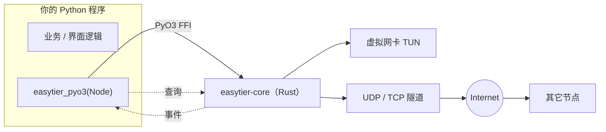

# EasyTier-PyO3 教程

[EasyTier-PyO3](https://github.com/ECLTeam/EasyTier-PyO3) 是 [EasyTier](https://github.com/EasyTier/EasyTier)（开源去中心化组网 / mesh P2P VPN）的 **Python 绑定库**，用 [PyO3](https://pyo3.rs) 编写。

它让你在 Python 里直接 `import easytier_pyo3` 就能创建、启动、管理一个 EasyTier 节点，而**不需要**去拉取 `easytier-core` 可执行文件、拼命令行、解析 stdout。查询对端与路由快照、订阅节点事件、运行时改端口转发、管理接入凭证，全都是普通的方法调用。

::: tip 前提需要
本教程面向已经会写 Python 的读者，动手前请确认：

1. 掌握 Python 基础：虚拟环境、`pip`、`dict`/`list`、`try`/`except`、线程的基本用法
2. 使用 **Python 3.11 及以上**的 64 位解释器（本库不提供 3.9 / 3.10 的构建产物）
3. 了解基础网络概念：IP 地址、CIDR 子网（如 `10.144.144.1/24`）、端口、TCP / UDP
4. 知道什么是虚拟网卡（TUN）会更好，但**不是必须**——教程会先带你用免 TUN 的方式跑通
:::

> 📝 **说明**：本教程以「思路 + 可运行片段」为主，示例均取自本项目自身的用法整理，目标是让你能自己搭出可用的组网程序，而不是复制粘贴一个成品。

---

## 它解决什么问题

EasyTier 做的事，是把分布在世界各地的若干台机器组成一张**虚拟局域网**：每台机器拿到一个虚拟 IP（例如 `10.144.144.1`），之后就像在同一个交换机下面一样互相访问，流量端到端加密，能打洞就 P2P 直连、打不动洞就走中继。

EasyTier 官方提供的是 CLI（`easytier-core` / `easytier-cli`）。如果你的程序本身是 Python 写的，用 CLI 就意味着：

| 用 CLI | 用 EasyTier-PyO3 |
|--------|------------------|
| 生成配置文件 / 拼命令行参数 | 直接传 `dict` 或 TOML 字符串 |
| `subprocess` 起进程，解析 `stdout` / `stderr` | 调用方法，拿回 Python `dict` / `list` |
| 靠退出码和日志字符串判断状态 | `state()` / `is_ready()` / `latest_error()` |
| 想看对端信息得解析 `easytier-cli peer` 的表格 | `peers()` / `routes()` 直接返回结构化数据 |
| 改运行期配置要重启进程或发 RPC | `apply_config()` / `add_connector()` 直接生效 |

对启动器、联机工具、内网穿透面板这类需要**在程序内部把自己的状态和 UI 绑在一起**的场景，后者显然更好用。



---

## 环境与安装

### 直接安装

```bash
pip install easytier-pyo3
```

### 验证

```bash
python -c "from easytier_pyo3 import version; print(version())"
# 输出类似: 2.6.4 （EasyTier 内核版本）
```

### 支持的平台

| 系统 | 架构 | Python | 说明 |
|------|------|--------|------|
| Linux | x86_64 | 3.11 / 3.12 / 3.13 | manylinux 2_28（glibc 2.28+） |
| Windows | x86_64 | 3.11 / 3.12 / 3.13 | 功能完整（含 fake-tcp） |
| Windows | ARM64 | 3.11 / 3.12 / 3.13 | 实验性；aarch64 不支持 WinDivert，以基础隧道为主 |
| macOS | arm64 | 3.11 / 3.12 / 3.13 | `macos-latest` |

> 💡 **想从源码构建**（改代码、编译私有版本）需要 Rust 1.85+、`maturin` 和 C/C++ 工具链，首次构建要联网下载 EasyTier 的数百个依赖，可能耗时 **10 ~ 40 分钟**。完整步骤见仓库的 `docs/BUILDING.md`，本教程不重复展开。

### 关于权限（先有个心理预期）

- **Linux**：创建 TUN 需要 `CAP_NET_ADMIN`（通常就是 `sudo`），或给可执行文件加 `cap_net_admin` 能力。
- **macOS**：创建 TUN 需要 root。
- **Windows**：创建 TUN 需要**以管理员身份运行**。

不需要 TUN 的场景（只测连通性、只做端口转发、只想验证对端发现）可以用 `flags.no_tun = True` 跑，普通权限即可 —— 下面的示例就走这条路。

---

## 五分钟跑通：单机双节点

真正开始之前，先确认这个库能跑起来。下面这段代码在一台机器上起两个节点：A 监听 `127.0.0.1:11010`，B 主动连 A，两者应当互相发现对方。

```python
import time

from easytier_pyo3 import Node, version

print("内核版本:", version())

NET = {"network_name": "demo", "network_secret": "demo-secret"}
# no_tun=True        : 不创建 TUN 设备（无需管理员权限）
# bind_device=False  : no_tun 下必须关掉，否则 Windows 上连接会报 WSAEADDRNOTAVAIL(10049)
FLAGS = {"no_tun": True, "bind_device": False}

node_a = Node({
    "instance_name": "a",
    "network_identity": NET,
    "flags": FLAGS,
    "listeners": ["tcp://127.0.0.1:11010"],
})
node_a.start()
print("A:", node_a.state(), "peer_id =", node_a.peer_id())

node_b = Node({
    "instance_name": "b",
    "network_identity": NET,
    "flags": FLAGS,
    "peer": [{"uri": "tcp://127.0.0.1:11010"}],
})
node_b.start()

deadline = time.time() + 10
while time.time() < deadline and not node_b.peers():
    time.sleep(0.5)

print("A 看到的对端:", node_a.peers())
print("B 看到的对端:", node_b.peers())
print("B 的路由表:\n", node_b.dump_route())

node_a.stop()
node_b.stop()
```

看到两边 `peers()` 都非空，说明 EasyTier 内核、Python 绑定、事件与查询链路全部正常。

::: warning 三个最容易踩的坑
1. **不配 `listeners` 就不监听任何端口**。本库不经过 CLI，CLI 那个「默认监听 11010」的约定在这里**不存在**，B 连不上通常就是这个原因。
2. **`no_tun = True` 必须搭配 `bind_device = False`**，否则客户端 socket 会尝试绑定到还没生效的虚拟 IP，Windows 上报 `WSAEADDRNOTAVAIL(10049)`。
3. **两端 `network_name` / `network_secret` 必须完全一致**，否则会被判定为不同网络，永远发现不了对方。
:::

---

## 核心概念地图

读后面的章节时，脑子里挂着这张图会轻松很多：

| 概念 | 在 Python 里的样子 | 说明 |
|------|-------------------|------|
| 节点 | `Node(config)` 对象 | 一个节点 = 一个独立 tokio runtime + 一条事件总线 |
| 配置 | `dict` 或 TOML 字符串 | 字段与 `easytier-core` 的配置文件一致 |
| 网络身份 | `network_identity` | `network_name` + `network_secret`，是「同一张网」的唯一判据 |
| 虚拟地址 | `ipv4` / `ipv6` | 节点在这张虚拟网里的地址，如 `10.144.144.1/24` |
| 监听 / 对端 | `listeners` / `peer` | 别人怎么找到我 / 我怎么找到别人 |
| 运行时开关 | `flags` | 一大票行为开关（`no_tun`、`mtu`、加密、打洞…），有明确默认值 |
| 事件 | `events()` / `next_event()` | 对端加入、连接建立、TUN 就绪等，格式为 `{"事件名": 载荷}` |
| 快照查询 | `peers()` / `routes()` / `metrics()` | 主动拉取当前状态，返回结构化 `dict` / `list` |
| 运行期改配置 | `apply_config()` / `add_connector()` | 节点 Running 时也能改端口转发、路由、出口节点… |

---

## 目录

1. [节点配置详解](/tutorials/easytier-pyo3/fundamentals/configuration/) —— `Node()` 能接受什么、每个字段什么意思、`apply_config()` 能改哪些
2. [节点生命周期与运行期管理](/tutorials/easytier-pyo3/fundamentals/node-runtime/) —— 状态机、连接管理、快照查询、事件订阅、线程模型
3. [组网进阶与部署实践](/tutorials/easytier-pyo3/advanced/deployment/) —— 端口转发、路由与出口节点、接入凭证与 ACL、跨平台注意事项与排错

---

## 相关链接

- 本库源码与完整 API 文档：[ECLTeam/EasyTier-PyO3](https://github.com/ECLTeam/EasyTier-PyO3)
- 上游 EasyTier 项目：[EasyTier/EasyTier](https://github.com/EasyTier/EasyTier)
- 上游官方文档：[easytier.cn](https://easytier.cn)
- 授权：本库以 **LGPL-3.0** 发布（与 EasyTier 一致）
