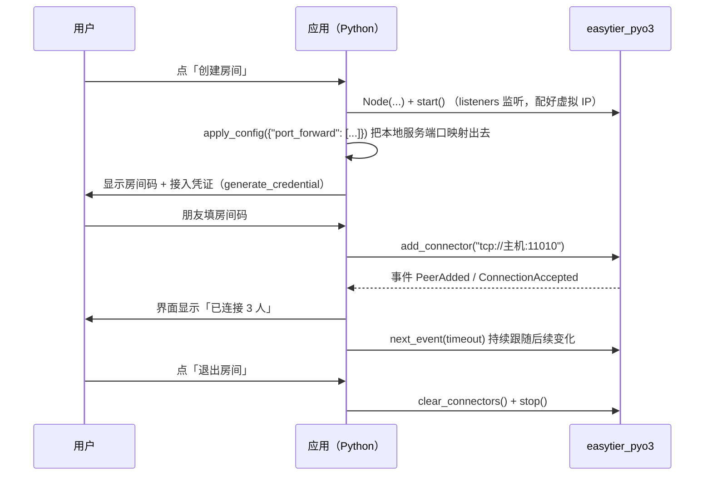

# 组网进阶与部署实践

前两章解决了「起得来」和「管得住」。这一章解决「用得好」：怎么把对端服务的端口映射到本地、怎么让别人借道你的机器上网、怎么安全地发放接入权限，以及跨平台部署时那些会咬人的细节。

---

## 1. 端口转发：把虚拟 IP 的端口搬到本地

**问题**：对端在虚拟网里跑着一个服务（`10.144.144.2:80`），但你的程序只会连 `127.0.0.1:xxxx`，也不想改代码去碰虚拟 IP。

**做法**：加一条端口转发规则，让本地 `127.0.0.1:8080` 直通对端的 `80`。

### 启动时配置

```python
node = Node({
    "network_identity": {"network_name": "net1", "network_secret": "secret"},
    "ipv4": "10.144.144.1/24",
    "port_forward": [
        {"bind_addr": "127.0.0.1:8080", "dst_addr": "10.144.144.2:80", "proto": "tcp"},
    ],
})
```

规则就三个字段：

| 字段 | 含义 |
|------|------|
| `bind_addr` | 本地监听地址，如 `127.0.0.1:8080`（只给本机用）或 `0.0.0.0:8080`（局域网可访问） |
| `dst_addr` | 目标地址，写**虚拟网里的 IP + 端口**，如 `10.144.144.2:80` |
| `proto` | 只支持 `tcp` / `udp` |

> ⚠️ `proto` 写别的值会直接抛 `ValueError`（与 CLI 的校验一致）。这是**唯一一个会在配置阶段就拦你**的字段，所以拼写错误能很快被发现。

### 运行期动态增删

端口转发是少数可以用 `apply_config()` 改的字段，所以「运行中的联机工具里，用户点一下『开一个本地端口』」这种需求可以实时生效：

```python
# 添加：本地 8080 → 对端 80
node.apply_config({
    "port_forward": [
        {"bind_addr": "127.0.0.1:8080", "dst_addr": "10.144.144.2:80", "proto": "tcp"},
    ],
})

# 再加一条：本地 25565 → 对端 25565（游戏服务端）
node.apply_config({
    "port_forward": [
        {"bind_addr": "127.0.0.1:8080",  "dst_addr": "10.144.144.2:80",    "proto": "tcp"},
        {"bind_addr": "127.0.0.1:25565", "dst_addr": "10.144.144.2:25565", "proto": "tcp"},
    ],
})

# 清空所有转发（比如用户关闭了「共享」开关）
node.apply_config({"port_forward": []})
```

::: warning 集合类字段是全量覆盖
`port_forward` **不是追加语义**。第二次调用只写一条新规则，第一条就没了。
所以要自己维护一份完整规则列表：

```python
rules = [
    {"bind_addr": "127.0.0.1:8080", "dst_addr": "10.144.144.2:80", "proto": "tcp"},
]
node.apply_config({"port_forward": rules})

# 之后加规则：先改自己的列表，再整体下发
rules.append({"bind_addr": "0.0.0.0:9090", "dst_addr": "10.144.144.3:3306", "proto": "tcp"})
node.apply_config({"port_forward": rules})
```
:::

### 端口转发不是「内网穿透面板」

它只做**虚拟网内部**的转发：`dst_addr` 必须是一张网里的虚拟 IP。如果你想要「把对端身后的真实内网服务暴露出来」，那是下一节的 `proxy_network` 干的活。

---

## 2. 路由、代理网段与出口节点

前面讲的都是「节点之间怎么互通」。这一节讲怎么把**节点身后的真实网络**也接进来。

| 概念 | 字段 / 方法 | 解决的问题 |
|------|------------|-----------|
| 通告路由 | `routes` | 让虚拟网里所有人都知道「某个真实网段要从我这走」 |
| 代理网段 | `proxy_network` | 把某个真实网段（如家里的 `192.168.1.0/24`）代理进虚拟网 |
| 出口节点 | `exit_nodes` / `flags.enable_exit_node` | 让别的节点借你的机器上外网 |

### `routes`：宣告「我身后有什么」

```python
"routes": ["192.168.1.0/24", "10.10.0.0/16"]
```

配了之后，虚拟网里其他节点要访问 `192.168.1.x` 时，就会把流量交给这个节点转发。适合「办公室一台机器当网关，把整个办公室内网接进虚拟网」这种场景。

### `proxy_network`：把网段代理进虚拟网

```python
"proxy_network": [
    {"cidr": "192.168.1.0/24"},
    {"cidr": "10.10.0.0/16", "allow": ["10.144.144.0/24"]},   # 只允许其中一部分节点访问
]
```

- `cidr` 是要代理进来的真实网段；
- `allow` 可选，是一个**允许访问该网段的虚拟网段白名单**。不写就是全放开。

和 `routes` 的关系可以粗略理解为：`proxy_network` 说「我身后有这张网（并可能限制谁能用）」，`routes` 说「通告这些网段的路由」。实际使用时两者通常会一起配。

> 📝 这两个字段都能用 `apply_config()` 运行期覆盖（同样是全量覆盖语义），所以可以做「按需开关某个内网共享」的功能。

### 出口节点：借道别人上外网

**要提供出口能力的节点**（比如家里带宽充裕的那台）：

```python
node = Node({
    "network_identity": {...},
    "ipv4": "10.144.144.1/24",
    "flags": {"enable_exit_node": True},   # 声明自己愿意当出口
})
```

**想用别人出口的节点**：

```python
"exit_nodes": ["10.144.144.1"]
```

运行期想改，两条路都行：

```python
node.update_exit_nodes(["10.144.144.1"])          # 轻量：只改出口节点
node.apply_config({"exit_nodes": ["10.144.144.1"]})  # 通用：走 apply_config
```

> ⚠️ 出口节点意味着**你机器上的流量会全部或部分经别人出去**，同理你的机器也会承载别人的流量。这是信任和安全边界问题，不是技术问题 —— 只用在自己人能控制的机器之间。

---

## 3. 接入凭证与访问控制

### 为什么不能直接发 `network_secret`

`network_secret` 是「同网」的唯一判据。一旦发出去，对方就**永久**拥有这张网的全部权限，想收回只能改密钥、让所有人重配。

### 方案：接入凭证

**前提**：只有 **admin 节点**（配置了 `network_secret` 的节点）才能签发凭证，否则调用会抛 `RuntimeError`。

```python
cred = node.generate_credential(
    groups=["guest"],              # 必填：凭证所属组
    allowed_proxy_cidrs=[],        # 必填：允许代理的网段
    allow_relay=False,
    ttl_seconds=86400,             # 有效期 1 天
    reusable=True,                 # 是否可重复使用
)

print(cred["credential_id"])
print(cred["secret"])              # ★ 把这个 secret 给对端，作为它的 network_secret
print(cred["expiry_unix"])         # 过期时间戳
```

返回值中的 `secret` 就是分发给对端的接入密钥 —— 对端把它填进 `network_identity.network_secret` 后就能进网，且**到期自动失效**。

管理凭证：

| 方法 | 说明 |
|------|------|
| `credentials()` | 列出当前所有凭证（含 `credential_id`、`groups`、`expiry_unix`、`reusable`、`public_key_fingerprint` 等） |
| `revoke_credential(credential_id)` | 吊销，成功返回 `True`，不存在返回 `False` |
| `upsert_credential(...)` | 导入 / 更新一条已存在的凭证，发生变更返回 `True` |

```python
# 踢掉某个临时接入者
node.revoke_credential("abc")

# 看看现在还有谁被授权
for c in node.credentials():
    print(c["credential_id"], c["groups"], c["expiry_unix"], c["reusable"])
```

`upsert_credential()` 的签名是**参数完整的**（没有默认值），导入时要把字段一起写全：

```python
node.upsert_credential(
    credential_id="abc",
    credential_secret="def",
    groups=["guest"],
    allow_relay=False,
    allowed_proxy_cidrs=[],
    expiry_unix=1700000000,
    reusable=True,
)
```

凭证变更时会触发 `CredentialChanged` 事件，可以据此刷新界面上的「已接入用户」列表。

### ACL：限制「进网之后能干什么」

凭证解决的是「能不能进网」，ACL 解决的是「进来之后能访问什么」。

```python
node = Node({
    "network_identity": {...},
    "acl": {...},                          # ACL 规则
    "tcp_whitelist": ["80", "443"],        # 端口白名单
    "udp_whitelist": ["53"],
})
```

- 不配 `acl` 时**放行所有流量**（这是默认值，也是测试时不用关心的原因）；
- `tcp_whitelist` / `udp_whitelist` 是端口维度的白名单；
- 运行期可以用 `apply_config()` 整体覆盖 ACL 与白名单，改完若涉及分组，调 `refresh_acl_groups()` 刷新；
- `acl_stats()` 看统计，`acl_whitelist()` 看当前生效的白名单：

```python
print(node.acl_whitelist())   # {'tcp_ports': ['80', '443'], 'udp_ports': ['53']}
```

> 💡 ACL 与凭证的 `groups` 配合使用，才能做出「普通玩家只能连游戏端口，管理员可以连所有端口」这类分级策略。**给陌生人开放的房间一定要配 ACL**，否则对方进网后可以扫你整个网段。

---

## 4. 跨平台注意事项

### Windows

| 事项 | 说明 |
|------|------|
| 创建 TUN | **必须管理员权限**，否则启动失败 |
| 随包 DLL | wheel 里已带 `wintun.dll`、`Packet.dll`、`WinDivert64.sys`，模块导入时会自动把 pyd 所在目录加入进程 DLL 搜索路径，**不需要手动放置** |
| 网卡 | EasyTier 创建的是自己的独立 wintun 网卡（`et_*`），只加虚拟网段的 on-link 路由、**不设默认路由**，不会动你机器上其它 VPN（如 Radmin VPN）的网卡与路由 |
| 停止后 | 网卡与路由自动清理 |
| 同机回环测试 | 必须 `bind_device = false`，否则连接报 `WSAEADDRNOTAVAIL(10049)` |
| ARM64 | 实验性支持；EasyTier 在 aarch64 上**不支持 WinDivert**，以基础 TCP/UDP 隧道为主 |

### Linux

| 事项 | 说明 |
|------|------|
| 创建 TUN | 需要 `CAP_NET_ADMIN`（通常即 `sudo`），或给可执行文件授予该能力 |
| `netns` | 可以把节点放进指定网络命名空间（启动期配置，运行期不可改） |
| `socket_mark` | 需要通过 `flags.socket_mark` 给 socket 打 SO_MARK 以便配合路由策略时使用 |
| 构建 | 需要系统 `protoc`（`sudo apt install protobuf-compiler`） |

### macOS

创建 TUN 需要 root。构建需要 Xcode Command Line Tools 与 `brew install protobuf`。

> 📝 如果你的程序不是常驻管理员运行，一个常见做法是：**只在需要 TUN 时提权**，或者提供一个「免 TUN 模式」（`no_tun = true`）给用户兜底 —— 后者能做端口转发和事件监听，只是不能直接 ping 虚拟 IP。

---

## 5. 和启动器 / 联机工具怎么配合

把上面所有东西串起来，一个「点一下就能一起玩」的流程大致是这样的：



几条实践建议：

1. **状态别自己猜**，一切以 `state()` / `is_ready()` / `peers()` / `routes()` 为准 —— 上游内核比你的推测可靠。
2. **耗时操作放后台线程**：`start()`、快照查询都是阻塞的，虽然会释放 GIL，但会让调用它的那个线程停下来。UI 线程只做「读缓存 + 渲染」。
3. **失败要给可读原因**：把 `latest_error()` 的内容和「是否管理员 / 端口是否被占用」一起呈现给用户，比只弹一句「连接失败」有用得多。
4. **一定做退出的清理**：`stop()` 放 `finally`，保证 TUN 网卡、路由、监听端口都能释放。
5. **别把 `network_secret` 写进前端**：凭证走 `generate_credential()` 由 admin 节点签发，设短有效期，需要时 `revoke_credential()`。

---

## 6. 排错清单

| 现象 | 最可能的原因 | 怎么确认 / 解决 |
|------|-------------|----------------|
| 节点 `state()` 是 `Running`，但对方永远发现不了 | `network_identity` 不一致，或一方没配 `listeners` | 对比两端 `network_name` / `network_secret`；查 `running_listeners()` 是否为空 |
| `WSAEADDRNOTAVAIL(10049)` | `no_tun = true` 却忘了 `bind_device = false` | 两个标志一起设 |
| 启动抛 `RuntimeError` / TUN 创建失败 | 权限不足 | Windows 用管理员运行；Linux 加 `CAP_NET_ADMIN`；或改用免 TUN 模式 |
| 连接不上对端端口，但网内能 ping 通 | `port_forward` 没配 / 少配了规则 | `apply_config({"port_forward": [...]})` 是**全量覆盖**，检查完整规则表 |
| 端口转发报 `ValueError` | `proto` 不是 `tcp` / `udp` | 改成小写 `tcp` 或 `udp` |
| 统计值算出来是乱字符串 | `stats` 里的整型是字符串 | 计算前先 `int()` |
| 调用凭证方法抛 `RuntimeError` | 当前节点不是 admin 节点 | 节点配置里必须有 `network_secret` |
| 事件收不到 | 事件在订阅前就产生了，或缓冲被 `events()` 清空 | 先 `peers()` 对齐快照，再订阅；不要混用 `events()` 与 `next_event()` 的语义 |
| `apply_config()` 报错 | 节点不在 `Running` 状态，或改了启动期字段 | 先 `start()`；启动期字段（`listeners` / `flags` 等）改用新建节点 |
| 想动态加对端却没生效 | 用 `apply_config` 改了 `peer` | `peer` 不通过 `apply_config` 管理，用 `add_connector()` |
| 搭了监控但看不到数据 | 没导出指标 | 用 `prometheus_metrics()` 或 `metrics()` |

---

## 7. 本章小结

- **端口转发**把虚拟 IP 端口映射到本地，`bind_addr` / `dst_addr` / `proto` 三个字段，运行期可用 `apply_config()` 全量覆盖。
- **`routes` / `proxy_network` / `exit_nodes`** 解决「把节点身后的真实网络接进来」的问题；出口节点是信任问题，不是技术问题。
- **接入凭证**用于替代直接分发 `network_secret`：设有效期、可吊销，需 admin 节点签发；**ACL** 负责进网后的访问范围。
- 跨平台的核心差异只有一条：**创建 TUN 需要特权**。免 TUN 模式是很好的兜底。
- 绝大多数「连不上」都是 `network_identity`、`listeners`、`bind_device` 这三处配置问题 —— 排错时按这个顺序查。

到这里，从配置、生命周期、查询与事件，到端口转发、权限控制和部署，你已经把 EasyTier-PyO3 的用法过了一遍。剩下的就是去读一遍仓库里最完整的 [`Node` API 参考](https://github.com/ECLTeam/EasyTier-PyO3/blob/master/docs/python_api.md)，把自己需要的字段补上。
