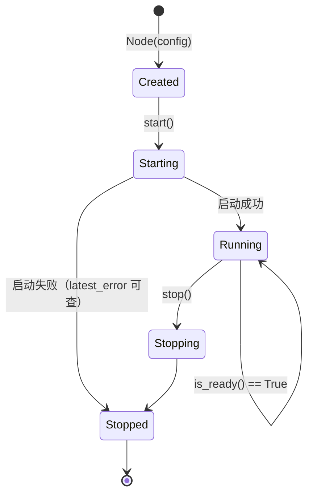

# 节点生命周期与运行期管理

配置只是「怎么起」。这一章讲「起来之后怎么管」：节点有哪些状态、怎么优雅地启停、怎么在运行期加删对端、怎么把对端/路由/指标读出来、怎么用事件把变化推到你的程序里。

::: tip 先记住一个前提
`Node` 的**所有方法都可以在多个 Python 线程中并发调用**。内部通过锁保护可变状态，不会出现 Rust 侧的 `Already mutably borrowed`。
同时，`start()` / `stop()` / 各类快照查询等「耗时」操作在内部**会释放 GIL**，所以后台线程阻塞等事件不会卡住主线程 —— 这正是「后台线程收事件 + 主线程刷 UI」这种写法的前提。
:::

---

## 1. 生命周期与状态机

一个节点从生到死，状态在下面几个值之间流转（`state()` 返回的字符串就是它们）：



| 方法 | 作用 | 备注 |
|------|------|------|
| `start()` | 启动节点，**阻塞**直到启动完成 | 失败抛 `RuntimeError` |
| `stop()` | 停止节点 | **幂等**，可重复调用，可在没有 start 时调用 |
| `wait()` | 阻塞直到节点停止 | 适合「主线程就当一个前台进程用」的场景 |
| `state()` | 返回当前状态字符串 | `Created` / `Starting` / `Running` / `Stopping` / `Stopped` |
| `is_ready()` | 是否已成功启动 | 等价于 `state() == "Running"` |
| `latest_error()` | 最近一次启动/运行错误 | 没有错误时返回 `None` |

### 启动失败怎么定位

`start()` 失败会抛 `RuntimeError`，但**异常信息未必包含全部细节**（比如 TUN 创建失败往往是异步上报的）。所以推荐同时做两件事：

```python
from easytier_pyo3 import Node

node = Node({
    "network_identity": {"network_name": "net1", "network_secret": "secret"},
    "ipv4": "10.144.144.1/24",
    "listeners": ["tcp://0.0.0.0:11010"],
})

try:
    node.start()
except RuntimeError as exc:
    print("启动失败:", exc)
    # 再看一次底层记录的错误，通常更具体
    print("latest_error():", node.latest_error())
    raise

print("状态:", node.state(), "| is_ready:", node.is_ready())
```

> ⚠️ 最常见的启动失败就是**权限**：Windows 上没以管理员运行、Linux 上没有 `CAP_NET_ADMIN`。此时如果只是要测连通性，加 `"flags": {"no_tun": True, "bind_device": False}` 即可绕过。

### `wait()` 与「优雅退出」

如果程序本身就是「把节点跑到底」，`wait()` 让主线程自然地挂在节点上：

```python
import signal

node = Node({...})
node.start()
print("已启动，Ctrl+C 退出")
signal.signal(signal.SIGINT, lambda *_: node.stop())  # 收到中断就去停止节点
node.wait()                                           # 阻塞到节点停止
print("已退出，最终状态:", node.state())
```

::: warning 一定要显式 `stop()`
`Node` 对象被 GC 回收时，只会在后台关闭它的运行时，**不保证清理 TUN 等系统资源**。
所以请把 `stop()` 写进你的 `finally` / 退出钩子里。停掉节点后，虚拟网卡与相关路由会自动清理。
:::

---

## 2. 基础信息

| 方法 | 返回 | 说明 |
|------|------|------|
| `instance_id()` | str | 节点唯一 ID（UUID）。没配 `instance_id` 时是自动生成的随机 UUID v4 |
| `instance_name()` | str | 节点名称（`instance_name`，默认 `"default"`） |
| `peer_id()` | int | 本节点在虚拟网络中的 peer id（由网络分配） |
| `running_listeners()` | list[str] | 当前**实际**在监听的地址（可用于确认端口是否真的起来了） |
| `management_events()` | list[str] | 最近产生的管理事件（字符串列表） |

```python
print(node.instance_name(), node.instance_id())
print("peer_id =", node.peer_id())
print("实际监听:", node.running_listeners())
```

`running_listeners()` 和配置里的 `listeners` 不是一回事：配置是「我希望监听什么」，前者是「内核真的监听上了什么」。端口被占用之类的失败会在这里暴露。

`peer_id()` 在节点刚启动、还没和网络握上手时可能还没被分配 —— 想拿稳定标识请用 `instance_id()`。

---

## 3. 手动连接管理

`peer` 只能在启动时给一次，运行期增删对端要用这三个方法：

| 方法 | 返回 | 说明 |
|------|------|------|
| `add_connector(url)` | None | 添加一个对端连接地址 |
| `remove_connector(url)` | bool | 移除指定地址，成功返回 `True` |
| `clear_connectors()` | None | 清空所有手动连接 |
| `connectors()` | list[dict] | 当前手动连接列表，每项形如 `{"url": ..., "status": ...}` |

```python
node.add_connector("tcp://10.0.0.5:11010")

for conn in node.connectors():
    print(conn["url"], conn["status"])   # status 反映这条连接是否已连上

node.remove_connector("tcp://10.0.0.5:11010")
```

典型用法：**「房间号 / 房间列表」式的联机功能**。用户在界面上切换房间时，你不用重建节点，只要换 connector：

```python
def join_room(node, host_ip: str, port: int = 11010) -> None:
    node.clear_connectors()                # 先离开上一处
    node.add_connector(f"tcp://{host_ip}:{port}")
```

> 💡 提醒一次：`uri` 的协议前缀（`tcp://` / `udp://`）要和对方 `listeners` 的协议对得上，且 `network_identity` 必须一致。

---

## 4. 快照查询：把节点状态读出来

以下方法内部会**阻塞等待 EasyTier 返回**，返回的都是普通 Python `dict` / `list`。

| 方法 | 返回 | 用途 |
|------|------|------|
| `peers()` | list[dict] | 所有对端的**连接**快照（连上了谁、走哪条连接） |
| `routes()` | list[dict] | 当前**路由**快照（网里都有谁、地址、开销、NAT 类型） |
| `node_info()` | dict | 本节点自身信息（地址、监听、版本、STUN 等） |
| `dump_route()` | str | 路由表的文本形式，**调试首选** |
| `global_peer_map()` | dict | 全局对端图快照 |
| `local_public_ipv6()` | dict | 本节点公网 IPv6 信息 |
| `foreign_networks(include_trusted_keys)` | dict | 外部网络快照，键为网络名 |
| `foreign_network_route_infos()` | dict | 外部网络路由信息 |
| `foreign_network_route_summary()` | dict | 外部网络路由汇总 |

```python
print("对端:", node.peers())
print("路由表:\n", node.dump_route())

info = node.node_info()
print(info["peer_id"], info["ipv4_addr"], info["version"])
```

### `peers()` 与 `routes()` 的区别

这是最容易搞混的一点，也是排障的关键：

- **`peers()` 回答「我和谁建立了连接」**。它是**连接视角**的，返回的是本机与各对端之间的隧道信息。
- **`routes()` 回答「这张虚拟网里都有谁、怎么走」**。它是**拓扑视角**的，包含那些并没有和你直连、而是隔着别人中转的节点。

所以「列表里应该有三个人但只有两个」这种情况，通常要用 `routes()` 去确认拓扑，而不是只看 `peers()`。

`peers()` 单项大致是这样：

```python
{
    "peer_id": 12346,
    "default_conn_id": "uuid-string",      # 主连接 id，可能为 None
    "directly_connected_conns": ["uuid-string"],
    "conns": [ ... ],                      # 每条连接的详情（stats / tunnel / loss_rate）
}
```

> ⚠️ **一个非常容易掉进去的坑**：`conns[].stats` 里的 `latency_us`、`rx_bytes`、`tx_bytes` 是 int64/uint64 经 pbjson 序列化后的结果，**在 Python 里是字符串**。做加法、换算前请先 `int()`，否则会得到字符串拼接或直接报错。
> ```python
> total_rx = sum(int(c["stats"]["rx_bytes"]) for p in node.peers() for c in p["conns"])
> ```
>
> 另一个相关的差异：`node_info()["ipv4_addr"]` 已经是 CIDR 字符串（如 `"10.144.144.1/24"`），而 `routes()` 里的 `ipv4_addr` 是 proto 的 `Ipv4Inet` 结构体（`address.addr` 是 32 位整数），需要自己用 `ipaddress` 模块转成可读格式。

### 想复刻 `easytier-cli peer` 那张表？

CLI 的表格**不是**某个方法的直接输出，而是把 `peers()` 和 `routes()` 按 `peer_id` 合并出来的。对应关系：

| CLI 列 | 取自 |
|--------|------|
| `ipv4` / `hostname` / `cost` / `version` | `routes()` 对应条目的同名字段 |
| `lat(ms)` | `peers()` 中 `default_conn_id` 那条连接的 `stats.latency_us / 1000` |
| `loss` | 同上连接的 `loss_rate` |
| `rx` / `tx` | `peers()` 所有 `conns[].stats` 的 `rx_bytes` / `tx_bytes` 求和 |
| `tunnel` | `peers()` 各连接的 `tunnel.tunnel_type` 去重后拼接 |
| `NAT` | `routes()` 对应条目的 `stun_info.udp_nat_type` |
| 本节点那一行 | `node_info()` |

---

## 5. 指标与 ACL 统计

| 方法 | 返回 | 说明 |
|------|------|------|
| `metrics()` | list[dict] | 全部指标快照，每项 `{"name": ..., "labels": {...}, "value": ...}` |
| `prometheus_metrics()` | str | 直接可被 Prometheus 抓取的文本格式 |
| `acl_stats()` | dict | ACL 统计信息 |
| `acl_whitelist()` | dict | 当前 ACL 白名单，形如 `{"tcp_ports": ["80"], "udp_ports": ["53"]}` |

想接监控系统，用 `prometheus_metrics()` 最省事：

```python
Path("easytier.prom").write_text(node.prometheus_metrics(), encoding="utf-8")
```

想在自己程序里画折线图（比如联机工具的「延迟 / 流量」面板），就用 `metrics()` 自己筛：

```python
for m in node.metrics():
    if "traffic" in m["name"]:
        print(m["name"], m["labels"], m["value"])
```

---

## 6. 事件订阅：让节点主动通知你

轮询 `peers()` 能拿到状态，但**拿不到「变化」**。要实时反映「有人进来了 / 掉线了 / 隧道断了」，用事件。

| 方法 | 返回 | 语义 |
|------|------|------|
| `events()` | list[dict] | **非阻塞**：取出当前所有待处理事件并清空缓冲 |
| `next_event(timeout)` | dict \| None | **阻塞**：等下一个事件；超时返回 `None` |

事件统一是 `{"事件名": 载荷}` 的 dict：

```python
import threading

def printer() -> None:
    while True:
        event = node.next_event(timeout=2.0)   # 内部释放 GIL，不卡主线程
        if event is not None:
            print("事件:", event)

threading.Thread(target=printer, daemon=True).start()
```

### 事件名一览

| 事件名 | 载荷 | 含义 |
|--------|------|------|
| `TunDeviceReady` | str | TUN 设备就绪（载荷是设备名） |
| `TunDeviceError` | str | TUN 设备错误 |
| `PeerAdded` / `PeerRemoved` | int（peer_id） | 对端加入 / 离开 |
| `PeerConnAdded` / `PeerConnRemoved` | dict | 与对端的连接建立 / 断开 |
| `ConnectionAccepted` | [local, remote] | 隧道建立 |
| `ConnectionError` | [local, remote, msg] | 隧道错误 |
| `ListenerAdded` | str | 监听启动成功 |
| `ListenerAddFailed` | [url, msg] | 监听启动失败 |
| `CredentialChanged` | None | 凭证发生变更 |
| `VpnPortalStarted` | str | VPN Portal 启动 |

实际打印出来大致是这样：

```python
{"TunDeviceReady": "easytier0"}
{"PeerAdded": 123}
{"PeerConnAdded": {...}}
{"ConnectionAccepted": ["tcp://0.0.0.0:11010", "tcp://1.2.3.4:4567"]}
```

::: tip `events()` 还是 `next_event()`？
- **做 UI / 做日志**：用 `next_event()` + 后台线程，事件来一条处理一条，实时性最好。
- **做批量状态刷新**（比如每秒刷一次界面）：用 `events()` 非阻塞地把这一秒内的事件全部取出来，一次处理完再统一刷新，省得频繁重绘。
- 两者**共用同一个缓冲**：`events()` 会把缓冲清空，所以别在同一个缓冲上既轮询又阻塞等待。
:::

### 事件是「尽力而为」的

事件用于**驱动交互**，不要当成可靠日志：节点刚启动时产生的事件可能在你开始订阅之前就发出去了。所以业务上正确的姿势是——**先用快照查询补齐当前状态，再用事件跟踪后续变化**：

```python
# 1. 先对齐当前状态
known_peers = {p["peer_id"] for p in node.peers()}

# 2. 再用事件跟上变化
while True:
    event = node.next_event(timeout=2.0)
    if not event:
        continue
    if "PeerAdded" in event:
        known_peers.add(event["PeerAdded"])
    elif "PeerRemoved" in event:
        known_peers.discard(event["PeerRemoved"])
```

---

## 7. 其它运行期操作

| 方法 | 说明 |
|------|------|
| `update_exit_nodes(ips)` | 运行期更新出口节点列表（不想整份 `apply_config` 时的轻量写法） |
| `close_peer_conn(peer_id, conn_id)` | 主动关掉与某个对端的一条连接，用于「踢掉一条可疑链路」或强制重连 |
| `refresh_acl_groups()` | 刷新 ACL 组 |
| `attach_tun_fd(fd)` | 把一个**已存在的** TUN 文件描述符交给节点使用（自己管理 TUN 生命周期时才会用） |

`apply_config()` 的完整用法见 [上一章：节点配置详解](/tutorials/easytier-pyo3/fundamentals/configuration/) 的最后一节。

---

## 8. 串起来：一个小型节点管理器

把上面的东西合到一个可复用的类里，就是启动器 / 联机工具里「网络模块」的雏形：

```python
import threading
from easytier_pyo3 import Node

NET = {"network_name": "my-room", "network_secret": "a-long-random-secret"}
FLAGS = {"no_tun": True, "bind_device": False}   # 正式环境去掉这两项以启用 TUN


class NetNode:
    """带事件回调的 EasyTier 节点封装。"""

    def __init__(self, name: str, ipv4: str | None = None, port: int = 11010) -> None:
        config = {
            "instance_name": name,
            "network_identity": NET,
            "flags": FLAGS,
            "listeners": [f"tcp://0.0.0.0:{port}"],
        }
        if ipv4:
            config["ipv4"] = ipv4
        self._node = Node(config)
        self._stop = threading.Event()
        self._thread: threading.Thread | None = None

    # ---------- 生命周期 ----------

    def start(self) -> None:
        self._node.start()
        self._thread = threading.Thread(target=self._pump, daemon=True)
        self._thread.start()

    def stop(self) -> None:
        self._stop.set()
        self._node.stop()          # stop() 幂等，重复调用无害

    # ---------- 事件泵 ----------

    def _pump(self) -> None:
        while not self._stop.is_set():
            event = self._node.next_event(timeout=1.0)
            if event is None:
                continue
            for name, payload in event.items():
                self.on_event(name, payload)

    def on_event(self, name: str, payload) -> None:
        """事件回调，子类 / 调用方按需覆盖。"""
        if name == "PeerAdded":
            print("有人进来了:", payload)
        elif name == "PeerRemoved":
            print("有人离开了:", payload)

    # ---------- 查询 ----------

    def peers(self) -> list:
        return self._node.peers()

    def route_text(self) -> str:
        return self._node.dump_route()

    @property
    def ready(self) -> bool:
        return self._node.is_ready()


if __name__ == "__main__":
    node = NetNode("me", ipv4="10.144.144.1/24")
    try:
        node.start()
        node._node.add_connector("tcp://10.0.0.5:11010")   # 主动连一个已知节点
        node._node.wait()
    finally:
        node.stop()
```

几个值得注意的设计点：

1. **事件泵跑在独立的 daemon 线程**，主线程完全不被占用。这能成立，靠的正是 `next_event()` 会释放 GIL。
2. **`stop()` 通过 `threading.Event` 做退出信号**，而不是依赖 `next_event()` 抛异常 —— `next_event()` 的 `timeout` 就是为这种「定时醒来检查一下退出条件」的循环设计的。
3. **`stop()` 放在 `finally`**，保证异常退出时也不会漏掉资源清理。

---

## 9. 本章小结

- 状态机只有 6 个状态，`start()` 失败先看 `latest_error()`，**权限问题**是最常见原因。
- 运行期加 / 删对端用 `add_connector()` / `remove_connector()` / `clear_connectors()`，别碰 `apply_config`。
- 排障用 `dump_route()` 看拓扑；`peers()` 是连接视角、`routes()` 是拓扑视角。
- `peers()` 里的统计值（延迟、流量）在 Python 里是**字符串**，计算前先 `int()`。
- 事件适合驱动 UI，但要「先快照对齐、再事件跟随」；`next_event()` 会释放 GIL，可放心用在后台线程。
- **一定显式 `stop()`**，别指望 GC 帮你清理 TUN。

下一章进入实战：端口转发、路由与出口节点、接入凭证与 ACL，以及跨平台的坑和排错清单。
